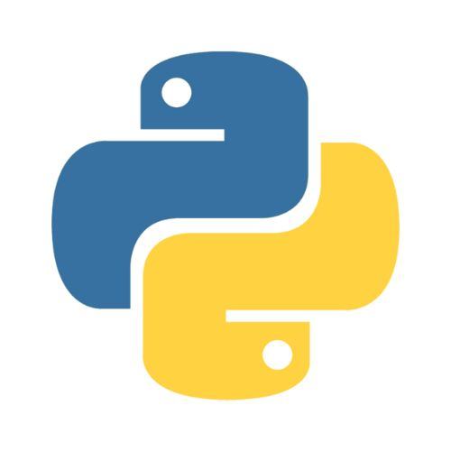
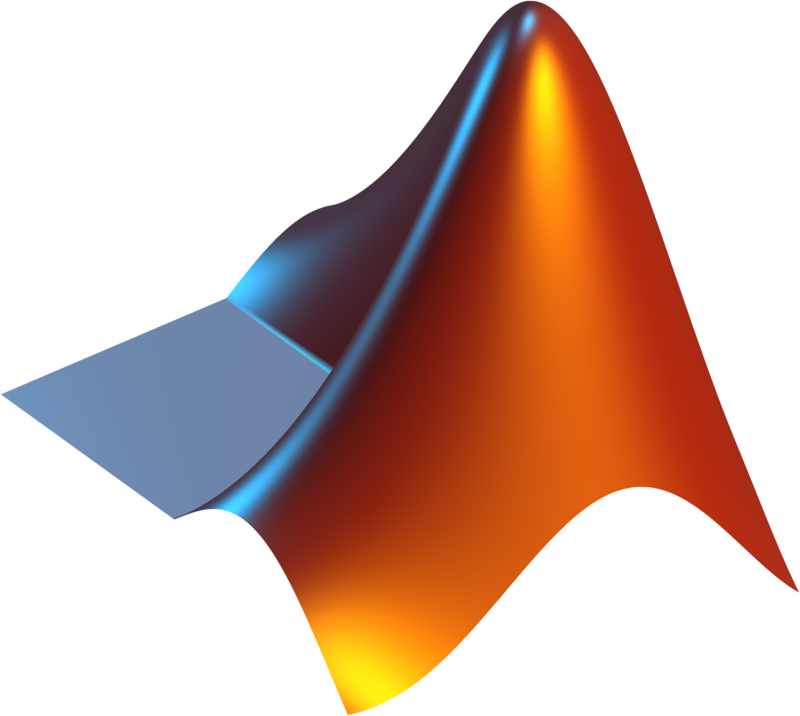

# Hi, I'm Fang 👋
I'm passionate about quant finance, portfolio management and trading - all things related to maximizing ROI 🫡 📈. 

📩 fangsitang@outlook.com  
👤 <a href="https://www.linkedin.com/in/fangsitang" target="_blank">LinkedIn</a>

Here's a brief overview of my skills, past work and projects 👇 :

## Technologies I work with 🔧

  
  
  
  

## Past work & Projects 🚀

<table border="0">
 <tr>
    <td><b style="font-size:30px">Title</b></td>
    <td><b style="font-size:30px">Title 2</b></td>
 </tr>
 <tr>
    <td>Lorem ipsum ...</td>
    <td>Lorem ipsum ...</td>
 </tr>
</table>

  

    
    
→ Derivatives pricing, hedging & valuation models

  

  

    
    
→ Trend-following trading algo using random forest & linear regression

  

  

